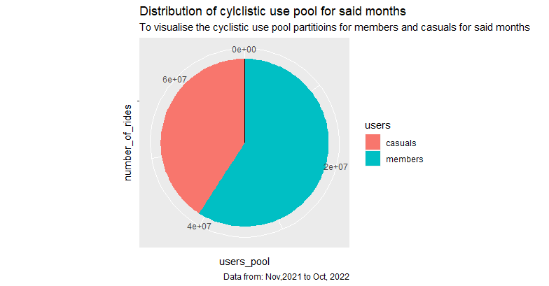
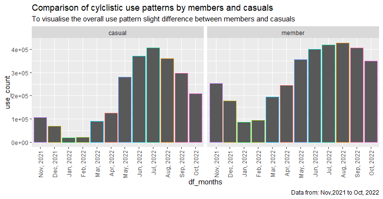
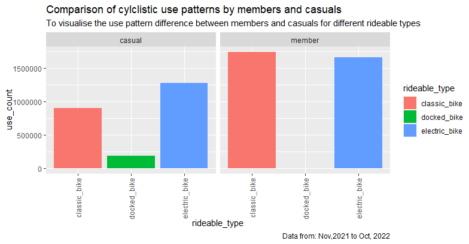
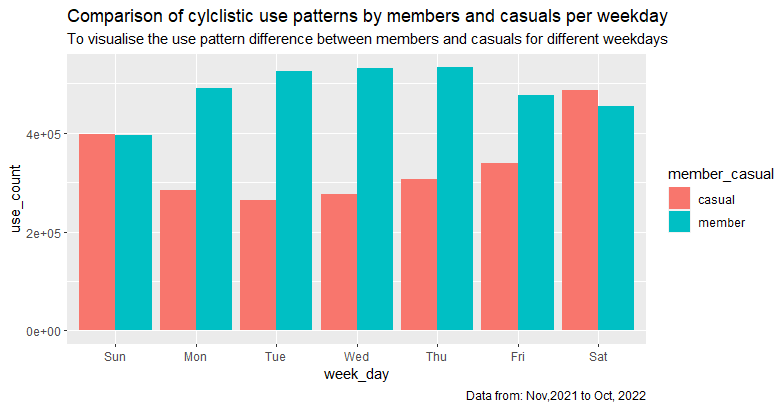
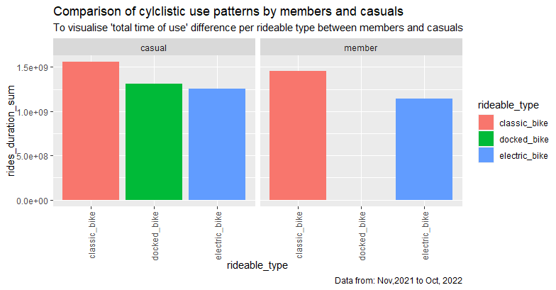
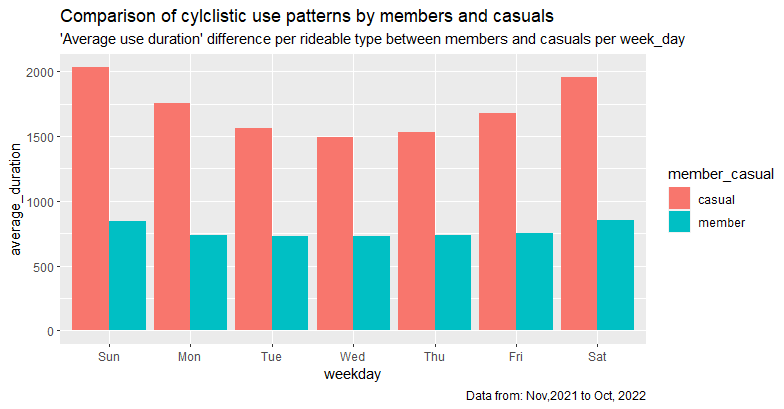

Project_Cyclistic
================
nforne
2022-11-23

### Divvy_Exercise_Full_Year_Analysis

# This analysis is based on the Divvy case study “‘Sophisticated, Clear, and Polished’: Divvy and Data Visualization” written by Kevin Hartman (found here: <https://artscience.blog/home/divvy-dataviz-case-study>). The purpose of this script is to consolidate downloaded Divvy data into a single dataframe and then conduct simple analysis to help answer the key question: “In what ways do members and casual riders use Divvy bikes differently?”

# \# \# \# \# \# \# \# \# \# \# \# \# \# \# \# \# \# \# \# \# \#

# Install required packages

# tidyverse for data import and wrangling

# lubridate for date functions

# ggplot for visualization

# \# \# \# \# \# \# \# \# \# \# \# \# \# \# \# \# \# \# \# \# \#

``` r
install.packages("tidyverse")
install.packages("here")
install.packages("skimr")
install.packages("janitor")
install.packages("rmarkdown")
install.packages("knitr")

library(rmarkdown)
library(knitr)
library(here)
library(skimr)
library(janitor)

library(tidyverse)  # helps wrangle data
library(lubridate)  # helps wrangle date attributes
library(ggplot2)  # helps visualize data
getwd() # displays your working directory
setwd("~/Project_Cyclistic") # sets your working directory to simplify calls to data ... make sure to use your OWN username instead of mine ;)
```

# =================================

# STEP 0: THINGS TO NOTE BEFORE …!

# ================================

# A description of all data sources used

# Source : <https://divvy-tripdata.s3.amazonaws.com/index.html>

# Offered to the public under the folloing licence: <https://ride.divvybikes.com/data-license-agreement>

# To summarize, from preliminary observations, the source, content and license indicate that the data ROCCC

# R = Reliable

# O = Original

# C = Comprehensive

# C = Current

# C = Cited

# This is to ascertain the integrity and alignment of the this here data for the above mentioned project.

# Download and unzip the said data files into a working directory, then give them proper names and you’re good to go.

# =====================

# STEP 1: COLLECT DATA

# =====================

# Upload Divvy datasets (csv files) here

``` r
divvy_tripdata_202111_df <- read.csv("202111-divvy-tripdata.csv")
divvy_tripdata_202112_df <- read.csv("202112-divvy-tripdata.csv")
divvy_tripdata_202201_df <- read.csv("202201-divvy-tripdata.csv")
divvy_tripdata_202202_df <- read.csv("202202-divvy-tripdata.csv")
divvy_tripdata_202203_df <- read.csv("202203-divvy-tripdata.csv")
divvy_tripdata_202204_df <- read.csv("202204-divvy-tripdata.csv")
divvy_tripdata_202205_df <- read.csv("202205-divvy-tripdata.csv")
divvy_tripdata_202206_df <- read.csv("202206-divvy-tripdata.csv")
divvy_tripdata_202207_df <- read.csv("202207-divvy-tripdata.csv")
divvy_tripdata_202208_df <- read.csv("202208-divvy-tripdata.csv")
divvy_tripdata_202209_df <- read.csv("202209-divvy-tripdata.csv")
divvy_tripdata_202210_df <- read.csv("202210-divvy-tripdata.csv")
```

# ====================================================

# STEP 2: WRANGLE DATA AND COMBINE INTO A SINGLE FILE

# ====================================================

# Compare column names each of the files

# While the names don’t have to be in the same order, they DO need to match perfectly before we can use a command to join them into one file

``` r
glimpse(divvy_tripdata_202111_df)
glimpse(divvy_tripdata_202112_df)
glimpse(divvy_tripdata_202201_df)
glimpse(divvy_tripdata_202202_df)
glimpse(divvy_tripdata_202203_df)
glimpse(divvy_tripdata_202204_df)
glimpse(divvy_tripdata_202205_df)
glimpse(divvy_tripdata_202206_df)
glimpse(divvy_tripdata_202207_df)
glimpse(divvy_tripdata_202208_df)
glimpse(divvy_tripdata_202209_df)
glimpse(divvy_tripdata_202210_df)
```

# From the above observations, much is in order so the next step is to ensure that and proceed to stack all the data frames into one

``` r
clean_names(divvy_tripdata_202111_df)
clean_names(divvy_tripdata_202112_df)
clean_names(divvy_tripdata_202201_df)
clean_names(divvy_tripdata_202202_df)
clean_names(divvy_tripdata_202203_df)
clean_names(divvy_tripdata_202204_df)
clean_names(divvy_tripdata_202205_df)
clean_names(divvy_tripdata_202206_df)
clean_names(divvy_tripdata_202207_df)
clean_names(divvy_tripdata_202208_df)
clean_names(divvy_tripdata_202209_df)
clean_names(divvy_tripdata_202210_df)
```

# Stack the data frames into one

``` r
all_trips_df_v1 <- rbind(divvy_tripdata_202111_df, 
                         divvy_tripdata_202112_df,
                         divvy_tripdata_202201_df,
                         divvy_tripdata_202202_df,
                         divvy_tripdata_202203_df,
                         divvy_tripdata_202204_df,
                         divvy_tripdata_202205_df,
                         divvy_tripdata_202206_df,
                         divvy_tripdata_202207_df,
                         divvy_tripdata_202208_df,
                         divvy_tripdata_202209_df,
                         divvy_tripdata_202210_df)
```

# to make it easier to load all the data for operations

``` r
write.csv(all_trips_df_v1, "./all_trips_df_v1.csv", row.names = FALSE)
```

# load all_trips_df_v1 data set

``` r
all_trips_df_v1 <- read.csv("./all_trips_df_v1.csv")
```

# ======================================================

# STEP 3: CLEAN UP AND ADD DATA TO PREPARE FOR ANALYSIS

# ======================================================

# Inspect the new table that has been created

``` r
colnames(all_trips_df_v1)  # List of column names
nrow(all_trips_df_v1)  # How many rows are in data frame?
dim(all_trips_df_v1)  # Dimensions of the data frame?
head(all_trips_df_v1)  # See the first 6 rows of data frame.  Also tail(all_trips)
str(all_trips_df_v1)  # See list of columns and data types (numeric, character, etc)
summary(all_trips_df_v1)  # Statistical summary of data. Mainly for numerics
```

# There is a little more cleaning and transformation to do:

# (1) In the “member_casual” column, we want to make sure there are only two types of users.

# (2) We will want to add some additional columns of data – such as day, month, year – that provide additional opportunities to aggregate the data.

# (3) We will want to add a calculated field for length of ride since the 2020Q1 data did not have the “tripduration” column. We will add “ride_length” to the entire dataframe for consistency.

# (4) There are some rides where tripduration shows up as negative, including several hundred rides where Divvy took bikes out of circulation for Quality Control reasons. We will want to delete these rides.

# In the “member_casual” column, replace “Subscriber” with “member” and “Customer” with “casual”

# N.B.: “Level” is a special property of a column that is retained even if a subset does not contain any values from a specific level

# We begin by seeing how many observations fall under each usertype

``` r
table(all_trips_df_v1$member_casual)
```

# And there are only two types of users, as expected so we are good to proceed ….

# Add columns that list the date, month, day, and year of each ride

# This will allow us to aggregate ride data for each month, day, or year … before completing these operations we could only aggregate at the ride level

# <https://www.statmethods.net/input/dates.html> more on date formats in R found at that link

``` r
all_trips_df_v1$date <- as.Date(all_trips_df_v1$started_at) #The default format is yyyy-mm-dd
all_trips_df_v1$month <- format(as.Date(all_trips_df_v1$date), "%m")
all_trips_df_v1$day <- format(as.Date(all_trips_df_v1$date), "%d")
all_trips_df_v1$year <- format(as.Date(all_trips_df_v1$date), "%Y")
all_trips_df_v1$day_of_week <- format(as.Date(all_trips_df_v1$date), "%A")
all_trips_df_v1$df_months <- str_glue("{month(ymd_hms(all_trips_df_v1$started_at), label = TRUE)}, {year(ymd_hms(all_trips_df_v1$started_at))}")
```

# Add a “ride_duration” calculation to all_trips_df_v1 (in seconds)

# <https://stat.ethz.ch/R-manual/R-devel/library/base/html/difftime.html>

``` r
all_trips_df_v1$ride_duration <- difftime(all_trips_df_v1$ended_at, all_trips_df_v1$started_at)
```

# Inspect the structure of the columns

``` r
str(all_trips_df_v1)
```

# Convert “ride_duration” from Factor to numeric so we can run calculations on the data

``` r
is.factor(all_trips_df_v1$ride_duration)
all_trips_df_v1$ride_duration <- as.numeric(as.character(all_trips_df_v1$ride_duration))
is.numeric(all_trips_df_v1$ride_duration)
```

# Remove “bad” data

# The dataframe includes a few hundred entries when bikes were taken out of docks and checked for quality by Divvy or ride_duration was negative

# We will create a new version of the dataframe (v2) since data is being removed

# <https://www.datasciencemadesimple.com/delete-or-drop-rows-in-r-with-conditions-2/>

``` r
all_trips_df_v2 <- all_trips_df_v1[!(all_trips_df_v1$start_station_name == "HQ QR" | all_trips_df_v1$ride_duration<0),]
```

# =====================================

# STEP 4: CONDUCT DESCRIPTIVE ANALYSIS

# =====================================

# Descriptive analysis on ride_duration (all figures in seconds)

``` r
mean(all_trips_df_v2$ride_duration) # straight average (total ride length / rides)
median(all_trips_df_v2$ride_duration) # midpoint number in the ascending array of ride lengths
max(all_trips_df_v2$ride_duration) # longest ride
min(all_trips_df_v2$ride_duration) # shortest ride
summary(all_trips_df_v2)
```

# You can condense the four lines above to one line using summary() on the specific attribute

``` r
summary(all_trips_df_v2$ride_duration)
```

# Compare members and casual users

``` r
aggregate(all_trips_df_v2$ride_duration ~ all_trips_df_v2$member_casual, FUN = mean)
aggregate(all_trips_df_v2$ride_duration ~ all_trips_df_v2$member_casual, FUN = median)
aggregate(all_trips_df_v2$ride_duration ~ all_trips_df_v2$member_casual, FUN = max)
aggregate(all_trips_df_v2$ride_duration ~ all_trips_df_v2$member_casual, FUN = min)
```

# See the average ride time by each day for members vs casual users

``` r
aggregate(all_trips_df_v2$ride_duration ~ all_trips_df_v2$member_casual + all_trips_df_v2$day_of_week, FUN = mean)
```

# Notice that the days of the week are out of order. Let’s fix that.

``` r
all_trips_df_v2$day_of_week <- ordered(all_trips_df_v2$day_of_week, levels=c("Sunday", "Monday", "Tuesday", "Wednesday", "Thursday", "Friday", "Saturday"))
```

# Now, let’s run the average ride time by each day for members vs casual users

``` r
aggregate(all_trips_df_v2$ride_duration ~ all_trips_df_v2$member_casual + all_trips_df_v2$day_of_week, FUN = mean)
```

# analyze ridership data by type and weekday

``` r
all_trips_df_v2 %>% 
  mutate(weekday = wday(started_at, label = TRUE)) %>%  # creates weekday field using wday()
  group_by(member_casual, weekday) %>%  # groups by usertype and weekday
  summarise(number_of_rides = n()        # calculates the number of rides and average duration 
            ,average_duration = mean(ride_length)) %>%     # calculates the average duration
  arrange(member_casual, weekday)  # sorts
```

# use_pie_current_distrubution_of_use_pool for said months

``` r
all_trips_df_v2 %>% 
  select(started_at, member_casual, df_months) %>% 
  summarise(months = unique(df_months), 
            use_member = sum(member_casual=="member"),
            use_casual = sum(member_casual=="casual")) %>%
  summarise(members = sum(use_member), casual = sum(use_casual)) %>% 
  data.frame(users = c("members", "casuals"), values = c(.$members, .$casual)) %>% 
  ggplot(aes(x = "", y = values, fill = users)) + 
  geom_bar(stat = "identity") + geom_abline(slope = 1) +
  coord_polar("y") +
  labs(title="Distribution of cylclistic use pool for said months",
       subtitle = "To visualise the cyclistic use pool partitioins for members and casuals for said months",
       caption="Data from: Nov,2021 to Oct, 2022") +
  xlab("number_of_rides") + ylab("users_pool")
```

# use_count bar \_ overall

``` r
all_trips_df_v2 %>% 
  group_by(member_casual, year(ymd_hms(started_at)), month(ymd_hms(started_at), label = TRUE)) %>% 
  arrange(year(ymd_hms(started_at)), month(ymd_hms(started_at), label = TRUE)) %>% 
  ggplot(aes(x = fct_inorder(df_months), color = df_months)) + 
  geom_bar() +
  theme(legend.position = "none", axis.text.x = element_text(angle = 90, vjust = 0.5, hjust=1)) +
  facet_wrap(~member_casual) +
  labs(title="Comparison of cylclistic use patterns by members and casuals",
       subtitle = "To visualise the overall use pattern slight difference between members and casuals",
       caption="Data from: Nov,2021 to Oct, 2022") +
  xlab("df_months") + ylab("use_count")
```

# use_count by type

``` r
all_trips_df_v2 %>% 
  group_by(member_casual, rideable_type) %>% 
  arrange(rideable_type) %>% 
  ggplot(aes(x = rideable_type, fill = rideable_type)) + 
  geom_bar() +
  theme(legend.position = "right", axis.text.x = element_text(angle = 90, vjust = 0.5, hjust=1)) +
  facet_wrap(~member_casual) +
  labs(title="Comparison of cylclistic use patterns by members and casuals",
       subtitle = "To visualise the use pattern difference between members and casuals for different rideable types",
       caption="Data from: Nov,2021 to Oct, 2022") +
  xlab("rideable_type") + ylab("use_count")
```

# Let’s visualize the number of rides by rider type per week_day

``` r
all_trips_df_v2 %>% 
  mutate(weekday = wday(started_at, label = TRUE)) %>% 
  group_by(member_casual, weekday) %>% 
  summarise(number_of_rides = n()
            ,average_duration = mean(ride_duration)) %>% 
  arrange(member_casual, weekday)  %>% 
  ggplot(aes(x = weekday, y = number_of_rides, fill = member_casual)) +
  geom_col(position = "dodge") +
  labs(title="Comparison of cylclistic use patterns by members and casuals per weekday",
       subtitle = "To visualise the use pattern difference between members and casuals for different weekdays",
       caption="Data from: Nov,2021 to Oct, 2022") +
  xlab("week_day") + ylab("use_count")
```

# use_count by rides_duration_sum

``` r
ride_times_df <- all_trips_df_v2 %>% 
  drop_na(rideable_type, member_casual, df_months, ended_at, started_at) %>% 
  group_by(member_casual, rideable_type) %>% 
  arrange(rideable_type) %>% 
  summarise(rideable_type, member_casual, df_months, ride_duration = difftime(ended_at, started_at, units="secs"))

p_time_member <- ride_times_df %>%
  filter(member_casual=="member") %>% 
  aggregate(cbind(ride_duration) ~ rideable_type, data = ., sum) %>% 
  mutate(user = "member")

p_time_casual <- ride_times_df %>%
  filter(member_casual=="casual") %>% 
  aggregate(cbind(ride_duration) ~ rideable_type, data = ., sum) %>% 
  mutate(user = "casual")

rbind(p_time_member, p_time_casual) %>% 
  ggplot(aes(x = rideable_type, y = ride_duration, fill = rideable_type)) + 
  geom_bar(stat = "identity") +
  theme(legend.position = "right", axis.text.x = element_text(angle = 90, vjust = 0.5, hjust=1)) +
  facet_wrap(~user) +
  labs(title="Comparison of cylclistic use patterns by members and casuals",
       subtitle = "To visualise 'total time of use' difference per rideable type between members and casuals",
       caption="Data from: Nov,2021 to Oct, 2022") +
  xlab("rideable_type") + ylab("rides_duration_sum")
```

# Let’s create a visualization for average duration

``` r
all_trips_df_v2 %>% 
  mutate(weekday = wday(started_at, label = TRUE)) %>% 
  group_by(member_casual, weekday) %>% 
  summarise(number_of_rides = n()
            ,average_duration = mean(ride_duration)) %>% 
  arrange(member_casual, weekday)  %>% 
  ggplot(aes(x = weekday, y = average_duration, fill = member_casual)) +
  geom_col(position = "dodge") +
  labs(title="Comparison of cylclistic use patterns by members and casuals",
       subtitle = "'Average use duration' difference per rideable type between members and casuals per week_day",
       caption="Data from: Nov,2021 to Oct, 2022")
```

\#================================================= \# STEP 5: EXPORT
SUMMARY FILE FOR FURTHER ANALYSIS
\#================================================= \# Create a csv file
that we will visualize in Excel, Tableau, or my presentation software \#
For more info: <https://datatofish.com/export-dataframe-to-csv-in-r/> \#
R Markdown will be a preferred choice

``` r
all_trips_df_v2_lite <- aggregate(all_trips_df_v2$ride_duration ~ all_trips_df_v2$member_casual + all_trips_df_v2$day_of_week, FUN = mean)

write.csv(all_trips_df_v2_lite, file = './avg_ride_duration.csv')
```








# We’re done! Congratulations!
